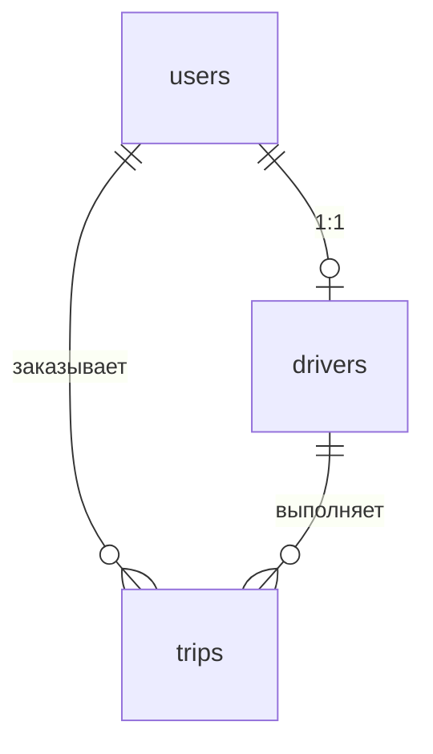

# База данных

Таблицы: `users`, `drivers`, `trips`.

Скрипты в корне репозитория:

- [`schema.sql`](../../schema.sql) — создание таблиц и индексов
- [`data.sql`](../../data.sql) — тестовые строки
- [`queries.sql`](../../queries.sql) — SQL под эндпоинты API
- [`optimization.md`](optimization.md) — EXPLAIN по основным запросам

## Связи



- У водителя один `user_id`, дубликатов нет (`UNIQUE`).
- Поездка всегда привязана к клиенту; `driver_id` пустой, пока заказ не приняли.
- Статусы: `pending` → `active` → `completed`.

## users

| Колонка | Тип | Примечание |
|---------|-----|------------|
| id | SERIAL | PK |
| login | VARCHAR(64) | уникален с учётом регистра (`lower(login)`) |
| first_name, last_name | VARCHAR(100) | NOT NULL |
| password_hash | VARCHAR(255) | пустая строка, если пароля нет |
| created_at | TIMESTAMPTZ | по умолчанию NOW() |

## drivers

| Колонка | Тип | Примечание |
|---------|-----|------------|
| id | SERIAL | PK |
| user_id | INTEGER | FK → users, UNIQUE |
| registered_at | TIMESTAMPTZ | |

## trips

| Колонка | Тип | Примечание |
|---------|-----|------------|
| id | SERIAL | PK |
| user_id | INTEGER | FK → users |
| driver_id | INTEGER | FK → drivers, nullable |
| status | VARCHAR(20) | pending / active / completed |
| created_at | TIMESTAMPTZ | |

## Индексы

Список с пояснениями — в [`optimization.md`](optimization.md). Основное:

- `idx_users_login_lower` — `GET /users/by-login`, логин
- `idx_users_full_name_trgm` — `GET /users/search` (нужен `pg_trgm`)
- `idx_trips_status_created` — `GET /trips/active`
- `idx_trips_user_status_created` — история поездок

## Партиционирование

В коде не делал. Если `trips` разрастётся, логично резать по `created_at` помесячно: старые партиции реже трогать, для отчётов с датой planner отсечёт лишнее.

## Как поднять

В Docker при первом старте postgres сам накатывает `schema.sql` и `data.sql`.

Вручную:

```bash
psql -h localhost -U user -d taxidb -f schema.sql
psql -h localhost -U user -d taxidb -f data.sql
```

Логин/пароль БД — в `.env.example`.

## Тестовые логины

| login | кто это | пароль |
|-------|---------|--------|
| client1, client2 | клиенты | — |
| driver1 (user 2), driver2 (user 5) | водители | — |
| authtest | для `/auth/login` | secret123 |
